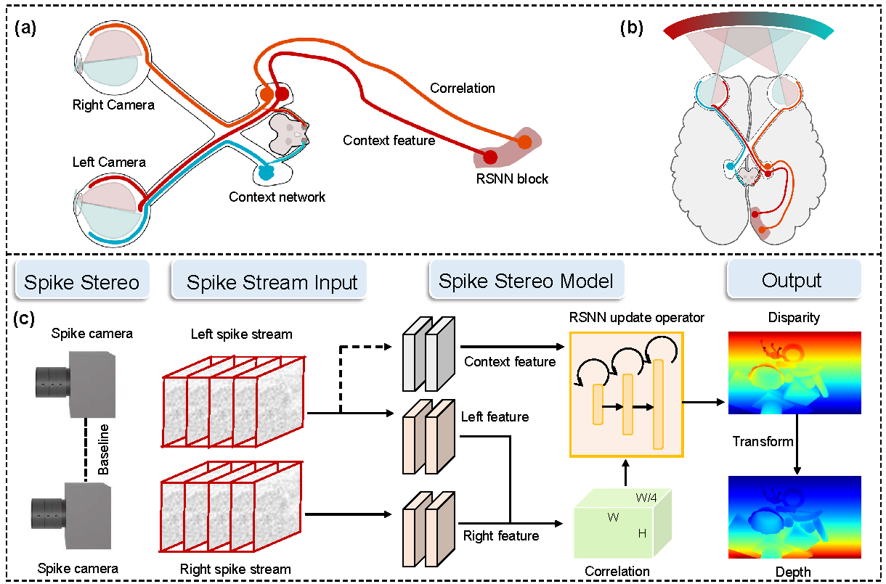

# SpikeStereoNet: A Brain-Inspired Framework for Stereo Depth Estimation from Spike Streams (ICLR 2026)
This repository contains the source code for our paper:

[SpikeStereoNet: A Brain-Inspired Framework for Stereo Depth Estimation from Spike Streams](https://openreview.net/forum?id=lPMPFeioCZ)<br/>
Zhuoheng Gao, Yihao Li, Jiyao Zhang, Rui Zhao, Tong Wu, Hao Tang, Zhaofei Yu, Hao Dong, Guozhang Chen, Tiejun Huang<br/>
School of Computer Science, Peking University<br>



## Environments

You can choose cudatoolkit version to match your server. The code is tested on PyTorch 1.10.1+cu113.

```bash
conda create -n spikestereonet python==3.9
conda activate spikestereonet
# You can choose the PyTorch version you like, we recommand version >= 1.10.1
# For example
pip3 install torch torchvision torchaudio --extra-index-url https://download.pytorch.org/whl/cu116
pip3 install -r requirements.txt
```

## Required Data
To evaluate/train SpikeStereoNet, you will need to download the required datasets. 
<!-- * --> 

```Shell
├── Synthetic
│   ├── Train
│   │   ├── scene_id
│   │   │   ├── spike_l
│   │   │   │   ├── frame_id_spike_l.dat
│   │   │   │   └── ...
|   │   │   ├── spike_r
│   │   │   │   ├── frame_id_spike_r.dat
│   │   │   │   └── ...
|   │   │   ├── depth
│   │   │   │   ├── frame_id_depth.exr
│   │   │   │   └── ...
│   │   └── ...
│   └── Test
│   │   └── ...
└── Real
    └── ...
```

## Evaluation

To evaluate a trained model on a Test set (e.g. Synthetic), run
```Shell
python evaluate_stereo.py --restore_ckpt models/spikestereonet-synthetic.pth --dataset gs1b-synth-spike
```

## Training

Our model is trained on two RTX-4090 GPUs using the following command. Training logs will be written to `runs/` which can be visualized using tensorboard.

```Shell
python train_stereo.py --batch_size 8 --train_iters 16 --valid_iters 32 --num_steps 320000 --dataset gs1b-synth-spike
```

## Converting Disparity to Depth 

If the camera intrinsics and camera baseline are known, disparity predictions can be converted to depth values using

Note that the units of the focal length are _pixels_ not millimeters. (cx1-cx0) is the x-difference of principal points.

## Citations

If you find our work useful in your research, please consider citing our paper.

```
@inproceedings{gao2026spikestereonet,
    title={SpikeStereoNet: A Brain-Inspired Framework for Stereo Depth Estimation from Spike Streams},
    author={Zhuoheng Gao and Yihao Li and Jiyao Zhang and Rui Zhao and Tong Wu and Hao Tang and Zhaofei Yu and Hao Dong and Guozhang Chen and Tiejun Huang},
    booktitle={The Fourteenth International Conference on Learning Representations (ICLR)},
    year={2026},
    url={https://openreview.net/forum?id=lPMPFeioCZ}
}
```

# Acknowledgements

This project refers to [RAFT-Stereo](https://github.com/princeton-vl/RAFT-Stereo), [DREDS](https://github.com/PKU-EPIC/DREDS) and [Spike2Flow
](https://github.com/ruizhao26/Spike2Flow). We thank the original authors for their excellent works.
